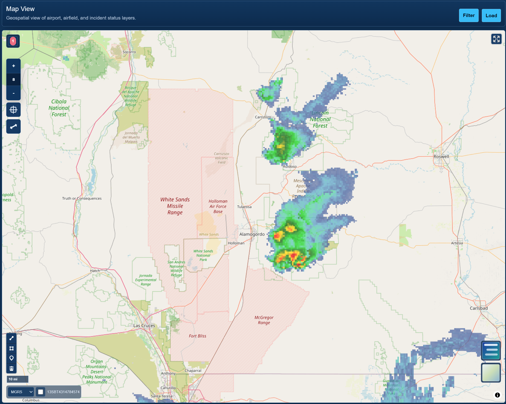

# Status App

This repository contains a status app linkable to geospatial data for dashboard and geospatial view of airport and airfield status. The app brings airport status, airfield condition, support asset, utility, and incident data into one Grails application that can be built and deployed as a single WAR file.

## Features

- Airport and airfield status dashboards.
- Geospatial links from status records into the map view.
- MapLibre map view backed by GeoServer WFS/GeoJSON layers.
- Configurable basemaps, layer selection, feature filtering, fit-to-layer, fullscreen, distance measurement, drawing, and coordinate readout with MGRS support.
- Editable lookup tables for dropdown text used by airport and incident workflows.
- Development bootstrap data for New Mexico airports and airfields, current status, runway surface condition, support assets, utilities, current incidents, and archived incidents.
- Single deployable WAR with the application served from `/GeoStatusBoard`.

## Screenshots



The screenshot above shows the geospatial status map with a New Mexico airfield operating area and weather overlay.

## Technology

- Grails 5.3.3
- Groovy 3.0.11
- GORM 7.3.3
- Gradle 7.6.6 wrapper
- Java 18 runtime
- Spring Security
- H2 development and test databases
- PostGIS and GeoServer for open source GIS deployment
- MapLibre GL JS for the browser map

## Project Layout

- `grails-app/` - Root status app configuration, security, home page, map view, and shared application setup.
- `gsb-airport/` - Airport, airfield, utility, and support asset status module.
- `gsb-incidents/` - Incident, current incident, archived incident, and facility damage module.
- `docs/` - Geospatial architecture notes, PostGIS spatialization SQL, and README images.
- `build.gradle` - Root build, WAR packaging, Java compatibility, and module dependencies.
- `settings.gradle` - Includes the airport and incident modules under the `geospatial-status-board` Gradle root project.

## Run Locally

Use the Gradle wrapper from the repository root:

```powershell
.\gradlew.bat :bootRun
```

The default local URL is:

```text
http://localhost:8080/GeoStatusBoard
```

To run on the development port used in recent local testing:

```powershell
.\gradlew.bat :bootRun --args="--server.port=18088"
```

Then open:

```text
http://localhost:18088/GeoStatusBoard
```

The default seeded admin account is:

```text
username: admin
password: admin123
```

## Build

Build the full project:

```powershell
.\gradlew.bat clean build
```

The deployable WAR is created at:

```text
build/libs/GeoStatusBoard.war
```

## Deployment Context

The app is configured to run under:

```text
/GeoStatusBoard
```

For example:

```text
http://localhost:8080/GeoStatusBoard
```

## Lookup Data

Dropdown values are managed through editable lookup tables so an administrator can update display text without changing domain constraints or GSP files.

Useful admin routes include:

```text
/GeoStatusBoard/airportLookupOption
/GeoStatusBoard/incidentLookupOption
```

Airport and incident lookup bootstrapping seeds New Mexico airports, airfields, event types, event categories, sources, status values, and agency-style service-owner values for development and test data. Service-owner options focus on FEMA, federal land/fire agencies, New Mexico state agencies, local fire departments, airport authorities, and emergency management organizations.

## Bootstrap Test Data

Bootstrap test data is enabled by default outside production. It adds missing sample rows to development/test tables without duplicating rows on every restart, so existing dev databases can pick up newly added seed data after the app restarts. Synthetic status and incident records only seed outside production. Current seed coverage includes:

- Airport status and current SIT rows for 15 New Mexico locations.
- Runway and airfield surface condition records.
- Engineer and fire fighting support asset records.
- Utility status records.
- Current FACDAM-style incident records.
- Archived incident records.

Bootstrapped locations include Kirtland AFB, Holloman AFB, Cannon AFB, Albuquerque International Sunport, Roswell Air Center, Spaceport America, Las Cruces International Airport, and other New Mexico airfields.

## Geospatial View

The app includes a MapLibre-based geospatial view at:

```text
/GeoStatusBoard/map
```

GSP links can open the map with a selected layer and feature filter, for example:

```text
/GeoStatusBoard/map?layer=airportStatus&field=site_name&value=Kirtland%20AFB
```

The map configuration lives under `geo.viewer`, `geo.geoserver`, and `geo.layers` in `grails-app/conf/application.yml`. The current default basemaps are CARTO Dark Blue and OpenStreetMap, and configured layers include airport status, current airfield status, airfield surface status, NAVAIDs, engineer assets, fire fighting assets, utility status, current incidents, and incident archive.

The recommended open source GIS stack is:

- PostGIS for geospatial columns and spatial indexes in the operational database.
- GeoServer for publishing database tables as WFS GeoJSON layers.
- MapLibre GL JS for the browser map view.

The Grails domains continue to read and write regular status fields through GORM. GeoServer reads geometry from PostGIS and supplies the map API. Weather, imagery, flight, road, or other external feeds can be added as additional GeoServer-published layers or direct map tile/vector services when the provider terms allow it.

See:

- `docs/postgis-spatialization.sql`
- `docs/geospatial-architecture.md`

## Data Sources

The root app configures the default datasource plus named datasources used by the included modules:

- `dataSource` - Root app data.
- `geodbfour` - Airport, airfield, utility, and support asset data.
- `geodbthree` - Incident data.

Development and test environments use H2 databases by default.
